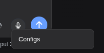
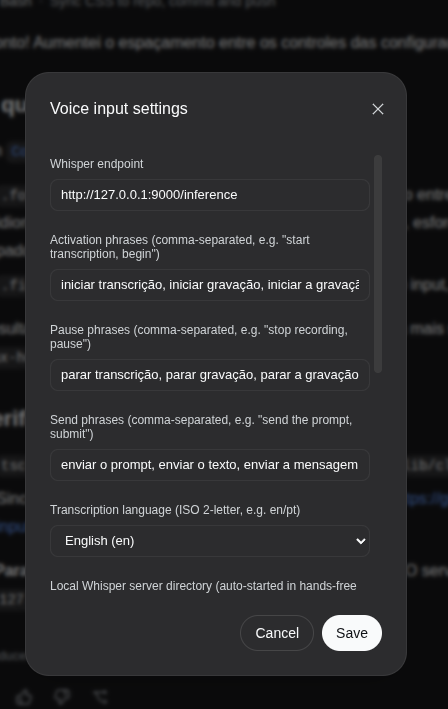

# dsh-voice-input

Voice input for the **DeepSeek Harness** (`dsh web`) GUI, powered by a **local
OpenAI Whisper** server.

A microphone button in the composer tool row records your voice, shows a live
waveform, transcribes the audio through a **local Whisper server**, and appends
the recognized text to your draft **without wiping what you already typed**. A
hands-free mode keeps the mic on and lets you control start / stop / send by
voice. Right-click the button to open the **Configs** dialog, where you can
change the model, point the server at any transcription provider, and tune the
rest.

Two pieces live here:

- **`plugin/ui-voice-input`** — the DeepSeek Harness client plugin (source).
- **`local-whisper-server`** — a small, self-contained faster-whisper HTTP
  server, kept **outside** the harness so any provider can be swapped in.

---

## Why local Whisper?

Transcription runs on **your machine**, no audio leaves the browser except to
your own `127.0.0.1` server. And because the plugin only ever talks to an HTTP
endpoint, you can point it at **any** provider — whisper.cpp, OpenAI `whisper`,
a cloud speech API, a corporate endpoint — or keep the bundled local server.

---

## Screenshots

The mic button sits in the composer tool row, between the context-window
indicator and the send button:


Right-click the mic button to open the **Configs** dialog:



In the Configs dialog you can change the transcription endpoint, the voice
command phrases, the language, the LLM cleanup settings (model, reasoning
effort, API key) and more — see [Configuration](#configuration):



---

## Repository layout

```
dsh-voice-input/
├── README.md                       ← you are here
├── LICENSE                         ← MIT
├── assets/                         ← screenshots used in this README
│   ├── composer-row.png
│   ├── configs.png
│   └── configs-menu.png
├── local-whisper-server/
│   ├── server.py                   ← FastAPI + faster-whisper
│   ├── requirements.txt
│   └── README.md                   ← server docs, env vars, smoke tests
└── plugin/
    └── ui-voice-input/             ← the dsh client plugin (source)
        ├── package.json
        ├── tsconfig.json
        ├── tsdown.config.ts
        ├── src/
        │   ├── index.ts            ← host (node) half: settings + auto-start
        │   ├── voice-settings.ts   ← the voice-input settings section + schema
        │   ├── whisper-lifecycle.ts← host-side validation / auto-start of the server
        │   └── client/             ← browser half: the button, capture, commands
        │       ├── VoiceInputButton.tsx  ← mic button + waveform + configs menu
        │       ├── ConfigModal.tsx       ← the Configs dialog
        │       ├── audio.ts              ← record / transcribe / clean / health
        │       ├── handsFree.ts          ← always-on mic + voice command loop
        │       └── commandMachine.ts     ← command-phrase matching
        └── README.md
```

> The plugin is a `@deepseek-ai/dsh-*` monorepo package: it depends on the
> harness's own client runtime, slots, settings, and locale packages. It is
> **not** a standalone npm bundle — you copy it into a DeepSeek Harness checkout
> and wire it up (see below). The Whisper server **is** fully self-contained.

---

## Features

- **Microphone button in the composer tool row**, placed between the context
  window indicator and the send button. Shows a **live waveform** reacting to
  audio intensity while recording.
- **Two modes** (described below): **click-to-record** and **hands-free**.
- **Right-click → Configs** dialog to configure everything interactively.
- **LLM cleanup** of transcriptions using the **recent conversation context**
  (a parallel `/clean` call — never pollutes the chat), with a configurable
  cleanup model and **reasoning effort** (default `off` for speed).
- **Provider-agnostic**: only an HTTP endpoint contract is required, so other
  speech-recognition / NLP providers can be plugged in without touching the
  plugin.
- **Settings persist** across browser and `dsh web` restarts (localStorage-backed,
  Host-synced).
- **Auto-start**: with hands-free active, the plugin’s host half validates the
  Whisper server (`GET /health`) and starts it automatically if it is down.

### Click-to-record

Click the mic to record, click again to stop and transcribe. The transcription
is appended to the draft (joined with a single space when the draft doesn’t end
in whitespace).

### Hands-free mode

Enable it in **Configs → “Hands-free mode (mic always on)”**. The mic stays on
and a voice-activity detector captures each utterance, transcribes it locally,
and interprets the configured **commands**. While capturing, speak freely; the
text accumulates. Clicking the button while hands-free toggles the capture
(start / stop) **without leaving** hands-free mode — the mic keeps listening for
commands.

Default commands (Brazilian Portuguese):

| Action  | Phrases (comma-separated) |
|---------|---------------------------|
| **start** capture | `iniciar transcrição`, `iniciar gravação`, `começar a gravação`, `iniciar captura`, `começar a gravar`, … |
| **stop** capture → draft | `parar transcrição`, `parar gravação`, `encerrar a gravação`, `pausar a gravação`, … |
| **send** to chat | `enviar o prompt`, `enviar a mensagem`, `submeter`, `enviar prompt`, … |

Commands are matched by **phrase** (multi-word), not single words, so a bare
word inside dictated speech cannot accidentally re-trigger a capture. Matching
is accent- and case-insensitive (`gravação` = `gravacao`), with a one-character
per-word edit tolerance.

> Use `pt` as the transcription language (Configs → Language) so a Brazilian
> accent is recognized.

---

## Installation into DeepSeek Harness (`dsh`)

You need a DeepSeek Harness **monorepo checkout** (the `dsh web` app you run at
`http://127.0.0.1:3080`). The steps below register the plugin in that checkout.

1. **Copy the plugin package** into the harness’s client package tree:

   ```sh
   # from this repo
   cp -r plugin/ui-voice-input <harness>/packages/client/ui-voice-input
   ```

2. **Add the workspace dependency** to `packages/bundle/web-app/package.json`
   (in the `dependencies` block):

   ```json
   "@deepseek-ai/dsh-client-ui-voice-input": "workspace:^"
   ```

3. **Register the plugin row** in `packages/bundle/web-app/cordis.patch.yml`:

   ```yaml
   - id: ui-voice-input
     name: '@deepseek-ai/dsh-client-ui-voice-input'
   ```

4. **Add the tsconfig path mapping** in `tsconfig.base.json` (in the `paths` map):

   ```json
   "@deepseek-ai/dsh-client-ui-voice-input": ["./packages/client/ui-voice-input/src"],
   ```

5. **Add the project reference** in `tsconfig.client.json`:

   ```json
   { "path": "./packages/client/ui-voice-input" }
   ```

6. **Build** the plugin and the web app:

   ```sh
   pnpm install
   pnpm --filter @deepseek-ai/dsh-client-ui-voice-input run bundle
   # rebuild / restart the web app, then hard-refresh the page
   ```

> The plugin’s `tsconfig.json` / `tsdown.config.ts` reference the harness’s shared
> `tsconfig.base.client.json` and `../tsdown.client.ts`, so it must live inside a
> harness checkout as `packages/client/ui-voice-input`.

---

## Running the local Whisper server

The server is a self-contained FastAPI app. Full docs (endpoints, env vars,
smoke tests) are in [`local-whisper-server/README.md`](local-whisper-server/README.md).

```sh
cd local-whisper-server
python3.12 -m venv venv
source venv/bin/activate
pip install -r requirements.txt

# recommended for the plugin (model + pt + port 9000 = plugin default)
WHISPER_MODEL=small WHISPER_LANGUAGE=pt python server.py
```

It listens on `http://127.0.0.1:9000` by default. The plugin’s default endpoint
is `http://127.0.0.1:9000/inference` (Configs → Endpoint).

With **hands-free** on, you don’t need to start it manually — the plugin’s host
half validates and auto-starts it.

---

## Configuration

### Configs dialog (right-click the mic button)

| Field | Meaning |
|-------|---------|
| **Endpoint** | where the plugin POSTs the recorded audio (an HTTP transcription endpoint). Default `http://127.0.0.1:9000/inference`. |
| **Activation / Pause / Send phrases** | the voice commands that start, stop (→ draft), and send a capture in hands-free mode. |
| **Transcription language** | two-letter ISO code, e.g. `pt`; empty = server auto-detect. |
| **Hands-free mode** | keep the mic on and listen for the commands. |
| **Clean up transcription** | enable the conversation-context LLM cleanup. |
| **Cleanup model** | the model used for cleanup (populated from the connection’s available models). |
| **Cleanup reasoning effort** | `off`/`low`/`high`/`max` for the cleanup LLM (`off` = fastest). |
| **API key** | the OpenAI-compatible key for the cleanup LLM. |
| **Local Whisper server directory** | where the plugin looks for the server source to auto-start (host side). |

Settings are stored under the `voice-input` settings namespace and persist in
`~/.dsh/settings.yaml` (and localStorage).

### Server environment variables

See [`local-whisper-server/README.md`](local-whisper-server/README.md) for the
full table (`WHISPER_MODEL`, `WHISPER_LANGUAGE`, `WHISPER_HOST/PORT`,
`CLEANUP_*`, `CLEANUP_REASONING_EFFORT`, …).

---

## Conversation-context LLM cleanup

When **Clean up transcription** is enabled, each transcription is sent to the
cleanup endpoint along with the **last few messages** of the conversation, so
the cleanup model can fix misrecognized words and stay consistent with the
topic. The call goes to `/clean` on the same server (which forwards to an
OpenAI-compatible chat-completions endpoint) and is **best-effort**: on failure
the raw transcription is kept. It never writes to the chat itself.

---

## Extending: other recognition / NLP providers

The plugin only requires an HTTP endpoint that accepts a multipart `file` part
(audio) and answers JSON with a `text` field (`/inference`), plus an optional
`/clean` route for LLM cleanup. To use a different provider:

1. Implement (or find) a server exposing `POST /inference` → `{ "text": "…" }`
   (optionally `POST /clean` → `{ "text": "…" }`).
2. Enable CORS for your `dsh web` origin.
3. Point the plugin’s **Configs → Endpoint** at it.

Examples: whisper.cpp `server`, OpenAI `whisper`, a cloud speech API behind a
compatible wrapper, a corporate/gated endpoint, or a translated model over the
same contract.

The `local-whisper-server` in this repo is the reference implementation (and the
default that is auto-started in hands-free mode). The host-side auto-start only
targets **this** local server; other providers run however they run, and the
plugin just talks to whatever endpoint you configure.

---

## Troubleshooting

- **The mic does nothing / no waveform** → browser microphone permission is
  blocked; allow it for your `dsh web` origin.
- **“Whisper server is not running”** red ring → the local server is down. With
  hands-free on it restarts automatically; otherwise start
  `local-whisper-server/server.py`.
- **Portuguese words mis-transcribed** → set **Transcription language** to `pt`
  and run the server with `WHISPER_LANGUAGE=pt`; use the `small` model (or
  larger) for accents.
- **Hands-free doesn’t catch the command** → commands are phrase-based and
  accent-insensitive; keep a distinctive multi-word phrase such as
  `iniciar gravação`. Adjust the phrases in Configs.
- **Cleanup returns the raw text** → the cleanup LLM needs a key
  (`CLEANUP_API_KEY` on the server, or “API key” in Configs) and a reachable
  `CLEANUP_BASE_URL`.

---

## License

MIT — see [`LICENSE`](LICENSE).
